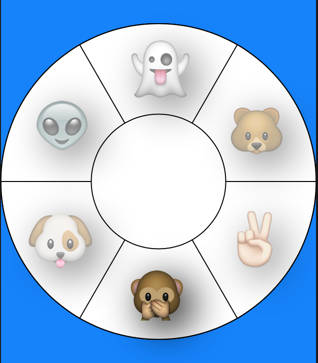

# HCRotaryWheel
A Rotary Wheel for altering content that can be customised in Interface Builder

Currently allows for up to 8 sectors in Interface Builder

Contact me at hannahcarneyart@gmail.com if you want any more added functionality

[](https://www.youtube.com/watch?v=pKzez4-whqY&feature=youtu.be)


## Functionality

- Rotates on a Timer until Wheel is touched
- Timer shuts off and then can be dragged or touched to spin the wheel
- Functionality for changing any content when wheel turns
- Background, number of elements, images and color of images can be changed in the Interface Builder
- Circular or square icons surrounding the images
- Drop shadows can be toggled
- Different section borders can be toggled on or off, background can be customized also



## Pod Installation

HCRotaryWheel is available through [CocoaPods](http://cocoapods.org). To install
it, simply add the following line to your Podfile:

```ruby
use_frameworks!
pod 'HCRotaryWheel', '~> 1.1'
```
### Note
adding use_frameworks! allows for Cocoapods to parse IBDesignable elements

## Manual Installation

1. Clone Project
2. Build in Xcode for example project
3. Drag Controls folder into your project
4. Enter class in Identity Inspector

<a href="http://www.freeimagehosting.net/commercial-photography/illinois/chicago/"></a>

Edit in Attributes Inspector

<a href="http://www.freeimagehosting.net/commercial-photography/illinois/chicago/"></a>

## How to use Objective-C

In your ViewController.h drag your HCRotaryWheelView as an IBOutlet and add RotaryProtocol to call Delegate Methods

    #import "HCRotaryWheel.h"
    
    @interface ViewController : UIViewController <RotaryProtocol>

      @property (weak, nonatomic) IBOutlet UILabel *textLabel;
      @property (weak, nonatomic) IBOutlet HCRotaryWheelView *rotaryWheelView;

    @end

In ViewController.m 

    - (void)viewDidLoad {
      [super viewDidLoad];
      //set view controller as delegate to Rotary Wheel
      self.rotaryWheelView.delegate = self;
      //set initial Text for a label or other content
      self.textLabel.text = @"Bear";
    }
  
    // built in HCRotaryWheel Delegate Method
     - (void) wheelDidChangeValue:(int)currentSector {
       // change any text when wheel rotates, is tapped or dragged
       self.textLabel.text = [self getDescriptionText:currentSector];
     }

    - (NSString *) getDescriptionText:(int)newValue {
      NSString *text = @"";
        switch(newValue) {
          case 0:
              text = @"Bear";
              break;
          case 1:
              text = @"Monkey";
              break;
          case 2:
               text = @"Dog";
              break;
         case 3:
              text = @"Ghost";
             break;
          case 4:
              text = @"Peace";
              break;
          case 5:
              text = @"Alien";
              break;
          default:
              break;
        }
        return text;
    }

## How to use Swift

    import UIKit
    import HCRotaryWheel

    class ViewController: UIViewController, RotaryProtocol {
    
        
        @IBOutlet weak var textField: UITextField!
        @IBOutlet weak var hcview: HCRotaryWheel!
        
        override func viewDidLoad() {
            super.viewDidLoad()
            self.hcview.delegate = self
            self.textField.text = "Bear"
            // Do any additional setup after loading the view, typically from a nib.
        }
    
        func wheelDidChangeValue(currentSector: Int32) {
            self.textField.text = self.getDescriptionText(currentSector);
        }
        
        func getDescriptionText(newValue :Int32) -> String
        {
            switch newValue {
            case 0:
                return "Bear"
            case 1:
                return "Monkey"
            case 2:
                return "Dog"
            case 3:
                return "Ghost"
            case 4:
                return "Peace"
            case 5:
                return "Alien"
            default:
                return "Bear"
            }
        }

## Author

Hannah Carney, hannahcarneyart@gmail.com

## License

HCRotaryWheel is available under the MIT license. See the LICENSE file for more info.
